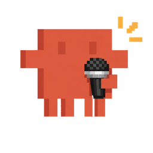
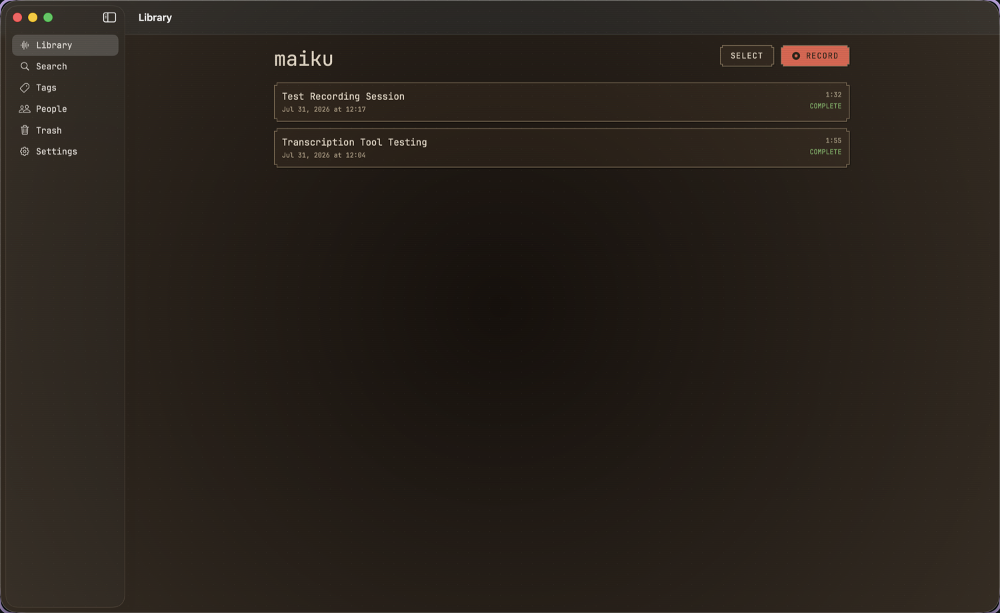
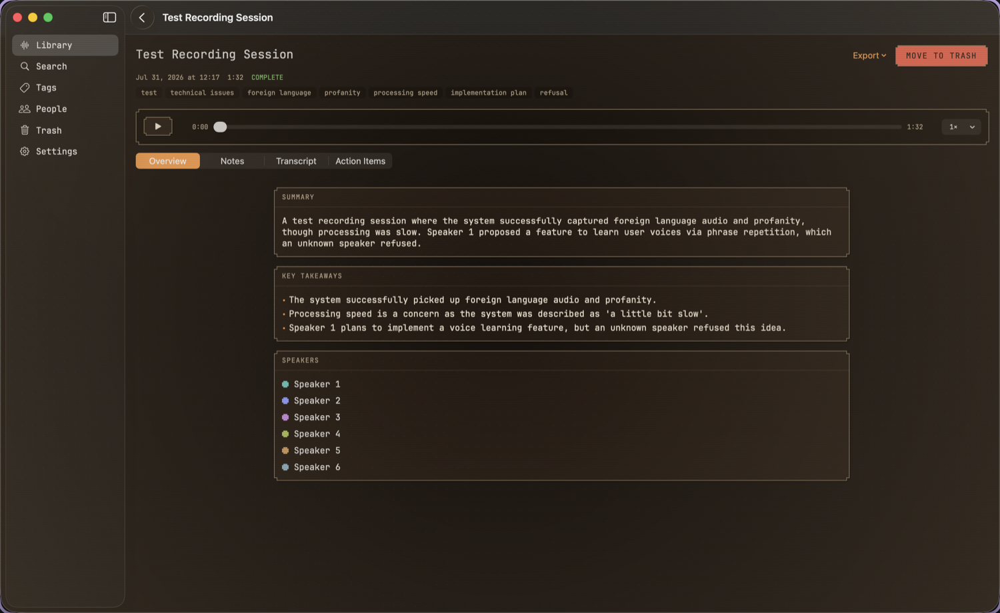
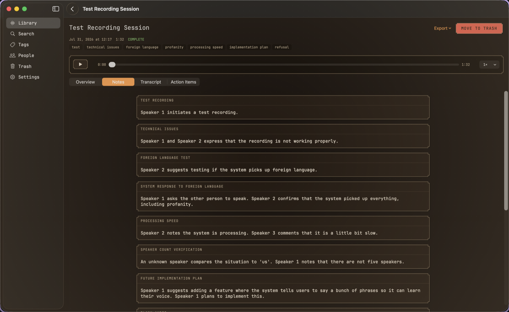
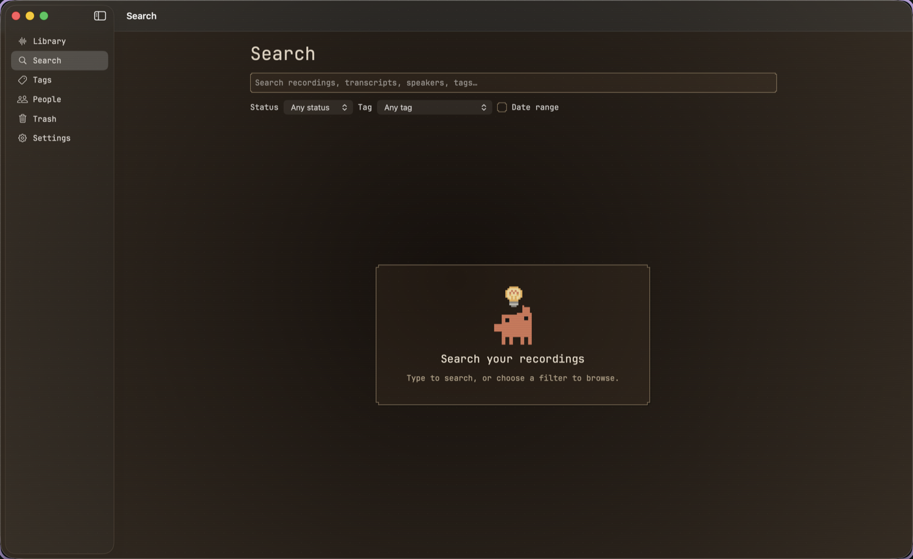
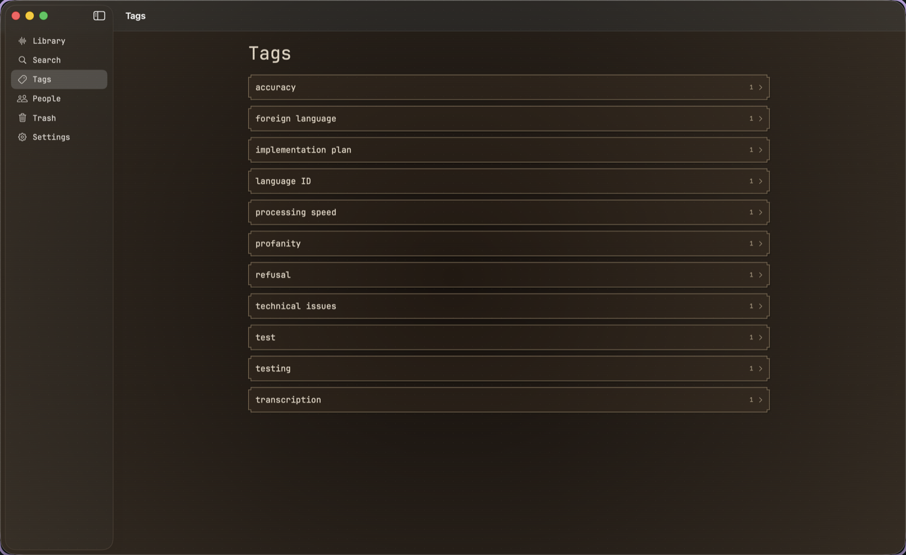
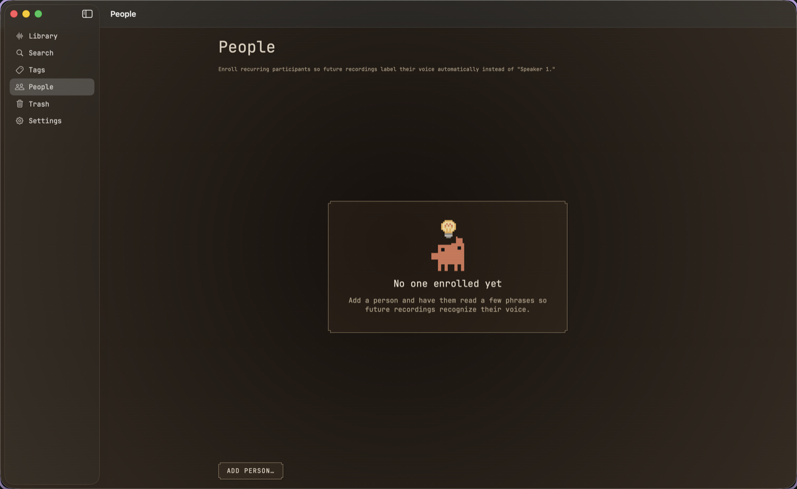
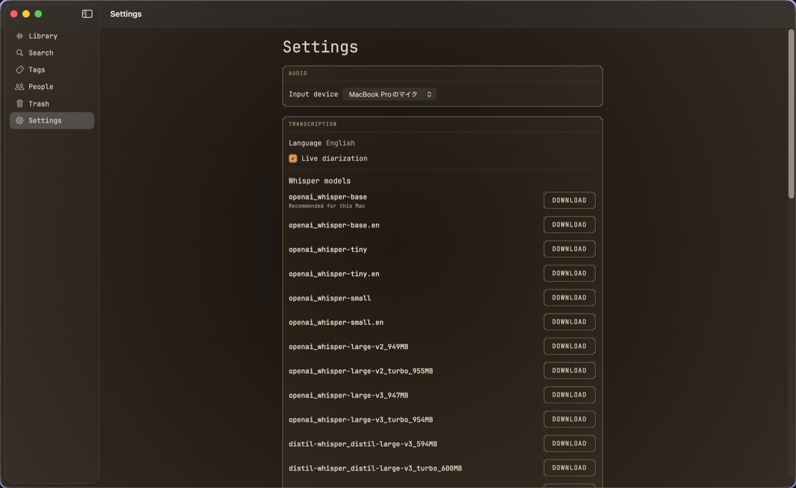

<p align="center">
  
</p>

<h1 align="center">maiku</h1>

<p align="center">
  Local-first meeting notes for macOS. Record a conversation, get a transcript with speaker<br>
  labels, and let a language model running on your own machine turn it into organized notes.
</p>

- **Nothing leaves your Mac except text you choose to send.** Audio, transcripts, and the
  database all stay local. Only transcript **text** goes out, and only to the LM Studio endpoint
  you configure (loopback by default).
- **Every generated claim cites its source.** Summaries, decisions, and action items link back
  to the transcript segment they came from. Click one to hear it.
- **Speakers, not "Speaker 1."** Rename a speaker once and it applies everywhere in that
  recording; enroll someone in People and future recordings recognize their voice on their own.

> **Status:** in development. See [`IMPLEMENTATION_STATUS.md`](IMPLEMENTATION_STATUS.md) for
> what actually works today, and the milestone checklist for what does not yet.

<p align="center">
  
</p>
<p align="center">
  <em>The Library: every recording, transcribed and organized, without leaving your Mac.</em>
</p>

**Get started:**

Download the `.dmg` from [Releases](../../releases/latest), open it, and drag `Maiku.app` to
`Applications`. maiku isn't notarized (no Apple Developer account behind this yet, see
[`Docs/DISTRIBUTION.md`](Docs/DISTRIBUTION.md)), so the first launch will be blocked by
Gatekeeper as "unidentified developer." Right-click `Maiku.app` → **Open** to run it anyway, or:

```bash
xattr -cr /Applications/Maiku.app
```

Or build it yourself:

```bash
git clone <this repo> && cd maiku
./scripts/build.sh          # builds and signs dist/Maiku.app
open dist/Maiku.app
```

On first launch maiku asks for microphone permission, offers to download a Whisper model, and
tests the connection to LM Studio.

---

## See it in action

<p align="center">
  
</p>
<p align="center">
  <em>Stop recording and maiku re-transcribes at higher accuracy, then hands the transcript to
  your local model for a summary, key takeaways, and a speaker list.</em>
</p>

<p align="center">
  
</p>
<p align="center">
  <em>Organized notes, grouped by topic, each one traceable back to what was actually said.</em>
</p>

---

## What it does

| Capability | What you get |
|---|---|
| **Live transcript** | See words appear as you speak, with speaker turns labeled as they happen |
| **Speaker rename** | Rename `Speaker 1` once and it updates everywhere in that recording |
| **Voice enrollment** | Enroll a recurring participant under **People**; future recordings label their voice automatically instead of a generic number |
| **Re-transcription pass** | After you stop, a higher-accuracy pass plus a final speaker pass clean up the live draft |
| **Organized notes** | Title, summary, topics, takeaways, decisions, action items, open questions, quotes, and tags, generated by your local LM Studio model |
| **Citations** | Every generated claim links to the transcript segment it came from. Click to hear it |
| **Search & export** | Full-text local search across recordings, transcripts, speakers, and tags; export to Markdown, TXT, JSON, SRT, or VTT |
| **Local MCP server** | Optional, off by default: expose your library read-only over MCP (`127.0.0.1` only) so Claude Desktop or another agent can look up recordings directly (see [`Docs/MCP_SETUP.md`](Docs/MCP_SETUP.md)) |

---

## Explore your library

<table>
<tr>
<td width="50%"></td>
<td width="50%"></td>
</tr>
<tr>
<td><strong>Search</strong>: full-text across recordings, transcripts, speakers, and tags, with status, tag, and date filters.</td>
<td><strong>Tags</strong>: every tag your notes generated, browsable as its own list, one recording per tap away.</td>
</tr>
<tr>
<td></td>
<td></td>
</tr>
<tr>
<td><strong>People</strong>: enroll a recurring participant by reading a few phonetically varied phrases, once.</td>
<td><strong>Settings</strong>: pick a mic, a Whisper model sized for your Mac, and toggle live diarization.</td>
</tr>
</table>

Deleted a recording by mistake? **Trash** holds it until you restore it or empty it, so nothing
is gone the instant you press delete.

---

## Requirements

| Requirement | Notes |
|---|---|
| macOS | 14 Sonoma or newer, Apple Silicon |
| Toolchain | Swift 6.0+, Xcode or just the Command Line Tools (see below) |
| [LM Studio](https://lmstudio.ai) | Optional, only needed for note generation. Recording and transcription work without it. At least one model downloaded if you use it. |
| Disk | Roughly 1-3 GB for speech models, depending on which Whisper size you pick |

## Building

There is no `.xcodeproj`. maiku is a Swift package, and `scripts/build.sh` wraps the built
executable in a proper `Maiku.app` bundle. macOS will not grant microphone permission
otherwise. This also means the project builds with only the Command Line Tools installed; a
full Xcode is optional.

```bash
./scripts/build.sh          # debug build + app bundle
./scripts/build.sh release  # optimized build
./scripts/test.sh           # unit tests
./scripts/lint.sh           # swift-format lint; `./scripts/lint.sh fix` to apply
```

All three exit nonzero on failure. If you have Xcode installed, `open Package.swift` works too.

## Documentation

| | |
|---|---|
| [`Docs/ARCHITECTURE.md`](Docs/ARCHITECTURE.md) | Modules, state machines, data flow |
| [`Docs/PRIVACY.md`](Docs/PRIVACY.md) | Exactly what stays local and what reaches LM Studio |
| [`Docs/MODEL_SETUP.md`](Docs/MODEL_SETUP.md) | Speech models, disk use, offline behaviour |
| [`Docs/MCP_SETUP.md`](Docs/MCP_SETUP.md) | Exposing your library read-only over MCP |
| [`Docs/TROUBLESHOOTING.md`](Docs/TROUBLESHOOTING.md) | Microphone, model, LM Studio, recovery |
| [`Docs/MANUAL_ACCEPTANCE.md`](Docs/MANUAL_ACCEPTANCE.md) | Real-hardware scenarios automated tests can't cover |
| [`Docs/DISTRIBUTION.md`](Docs/DISTRIBUTION.md) | Signing and notarizing a real build, once credentials exist |
| [`THIRD_PARTY_NOTICES.md`](THIRD_PARTY_NOTICES.md) | Dependencies, model and artwork licenses |
| [`LICENSE`](LICENSE) | MIT license for maiku's own code |

---

## Privacy

- **Audio never leaves your Mac.** Recording, transcription (WhisperKit), and diarization
  (FluidAudio) all run on-device.
- **Only transcript text is sent, and only for notes.** It goes to the LM Studio endpoint you
  configure, loopback (`127.0.0.1`) by default. Recording and transcription work with LM Studio
  never running.
- **No voiceprints leave a recording.** Enrollment recognizes a voice locally; nothing is
  uploaded, and the optional MCP server is read-only, `127.0.0.1`-only, and off by default.
- **No telemetry, no analytics, no accounts, no update checks.**

Full detail, including exactly what's on disk and every network request maiku ever makes:
[`Docs/PRIVACY.md`](Docs/PRIVACY.md).

## A note on recording others

maiku will happily record any conversation you point it at. Whether you are allowed to is your
responsibility. Consent requirements for recording differ by jurisdiction, and in many places
you must tell the other participants. maiku shows a recording indicator whenever the microphone
is live, but that is not a substitute for asking.

## Mascot

The app is themed around Clawd, who belongs to Anthropic. Only artwork the project maintainer
supplies directly, under their own authorization, ships here: as of this writing that's one
state (`listening`); every other state still renders a labelled placeholder until art for it is
supplied the same way. See [`Resources/Clawd/README.md`](Resources/Clawd/README.md).

maiku is an independent project and is not affiliated with Anthropic.
